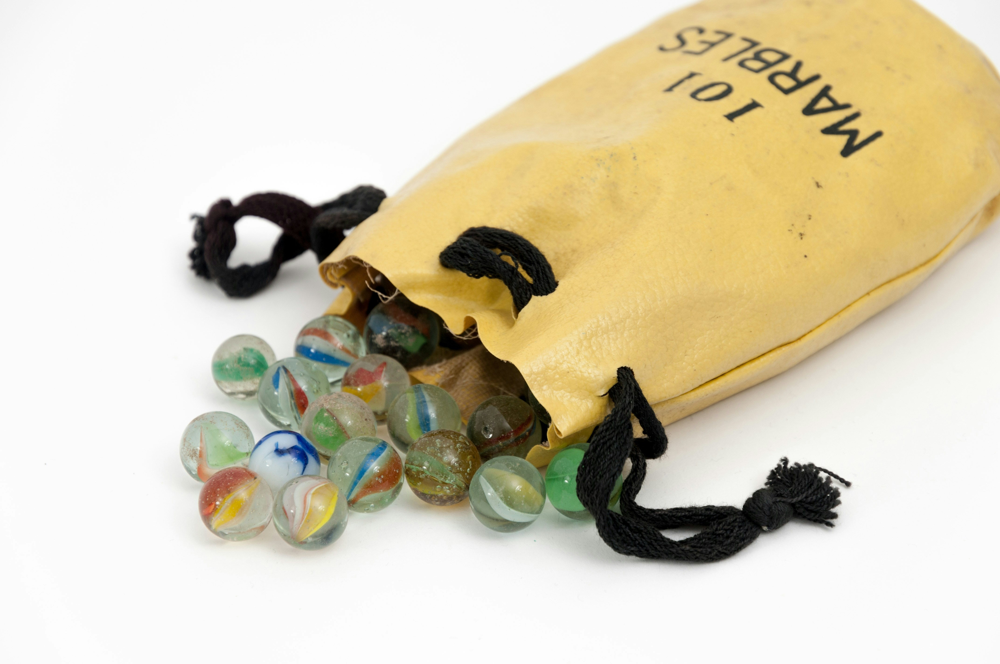

# MarbleScooper

A tiny Tkinter “scoop” game with a custom spoon sprite and randomized 5-second marble-roll audio slices.

## Run (source)
1. Install Python 3.11+.
2. Install deps: `python -m pip install -r requirements.txt` (or `python -m pip install pygame pillow`).
3. Launch: `python scooopgame.py`.

## Build (macOS app bundle)
From the repo root:
```
python -m venv .venv
.venv/bin/pip install -r requirements.txt pyinstaller
PYINSTALLER_CONFIG_DIR="./.pyinstaller" XDG_DATA_HOME="./.local/share" \
.venv/bin/pyinstaller -y --windowed --name "MarbleScooper" --icon crissy.icns \
  --add-data "freesound_community-roll-marbles-55488.mp3:." \
  --add-data "spoon.png:." \
  scooopgame.py
```
Output: `dist/MarbleScooper.app` (zip for sharing: `dist/MarbleScooper-mac.zip`).

## Build (Windows)
Run on Windows:
```
python -m venv .venv
.venv\Scripts\pip install -r requirements.txt pyinstaller
.venv\Scripts\pyinstaller -y --windowed --name "MarbleScooper" --icon "crissy.ico" ^
  --add-data "freesound_community-roll-marbles-55488.mp3;." ^
  --add-data "spoon.png;." ^
  scooopgame.py
```
Output: `dist/MarbleScooper/MarbleScooper.exe`.

## Preview


## Asset credits
- Audio: Film special effects roll marbles — https://pixabay.com/sound-effects/film-special-effects-roll-marbles-55488/
- Spoon image: from the legendary video (iykyk).
- Photo by <a href="https://unsplash.com/@crissyjarvis?utm_source=unsplash&utm_medium=referral&utm_content=creditCopyText">Crissy Jarvis</a> on <a href="https://unsplash.com/photos/marble-toy-lot-near-yellow-drawstring-pouch-1kZzV02D2hM?utm_source=unsplash&utm_medium=referral&utm_content=creditCopyText">Unsplash</a>

## Notes
- I Did not test it on windows
- If macOS Gatekeeper blocks the app, right-click → Open once or run `xattr -dr com.apple.quarantine dist/MarbleScooper.app`.

### License / Usage

  For study and personal use only; not licensed for commercial redistribution.
  If you need broader rights, please clear assets and code usage first.

  ### Current Pools & Odds

  - Base marble pool (uniform odds across items): Ring, Necklace, Bracelet, Hair
    clip, Hair Tie, Squishy, Shark Hair clip, Keychain, Mouse pad, Accessory,
    Sticker, Build Blocks, Book mark, Note clip, Eraser, Mini notebook, Note
    book, Post-it note, DIY-Diamond painting, Pencil case, Funny Pen, Multi-
    color Pen, Pen / Pencil, Mechanical pencil set, Highlighter, Planner, Mini
    hardcover.
  - Scoop size: 6–10 marbles uniformly at random.
  - Bonus scoop: 2% chance after a scoop (adds another 6–10 marbles, same pool/
    odds).

  ### How to Add or Tweak Marbles/Odds

  - Add a marble: edit marbles in scooopgame.py and append {"name": "New Item",
    "color": "#RRGGBB"}.
  - Bias odds without code changes: duplicate an entry in the list to increase
    its frequency; remove duplicates to decrease.
  - Precise weights (optional code tweak): replace the random.choice calls
    with random.choices(marbles, weights=[...], k=...) to control per-item odds
    explicitly.
  - Change scoop size: adjust random.randint(6, 10) in do_scoop (and in
    do_bonus_scoop if you want the bonus size to match).
  - Change bonus chance: edit the if random.randint(1, 50) == 1 check (e.g., use
    random.randint(1, 20) == 1 for a 5% chance).
